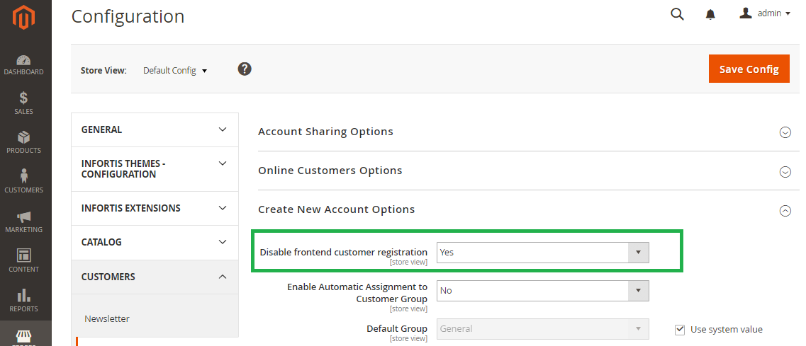
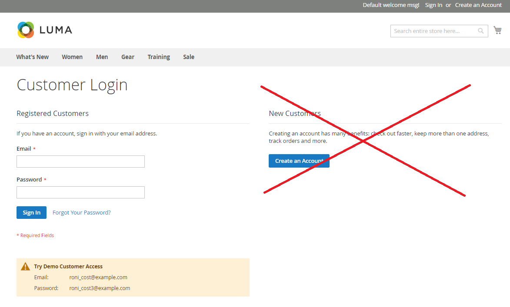

# Magento 2 - Disable customer registration

## Overview

This module enables the possibility to disable customer registration on the frontend.
It is particularly useful for B2B stores where customers should not be able to register by themselves.
The extension removes the link to the registration page and hides the registration form on the login page.

## Compatibility

| Module version | Magento version | PHP version     |
|----------------|-----------------|-----------------|
| 2.x            | 2.4.8           | 8.2, 8.3, 8.4   |
| 1.x            | 2.1.x – 2.3.x   | 7.0, 7.1, 8.1   |

## Requirements

- Magento Open Source / Adobe Commerce 2.4.8
- PHP 8.2, 8.3, or 8.4

## Installation

```bash
composer require sbodak/magento2-b2b-disable-customer-registration
php bin/magento module:enable Bodak_DisableRegistration
php bin/magento setup:upgrade
php bin/magento cache:clean
```

## Configuration

1. Go to the Magento admin panel
2. Navigate to `Stores > Configuration > Customers > Customer Configuration`
3. Under the `Create New Account Options` tab, find the `Disable frontend customer registration` option
4. Set it to `Yes` to disable registration

### Admin configuration



### Frontend result



## Development

### Running unit tests

```bash
composer install
vendor/bin/phpunit
```

## Uninstall

```bash
php bin/magento module:disable Bodak_DisableRegistration
composer remove sbodak/magento2-b2b-disable-customer-registration
```

## Changelog

See [CHANGELOG.md](CHANGELOG.md) for a full history of changes.

## License

[MIT License](LICENSE)
